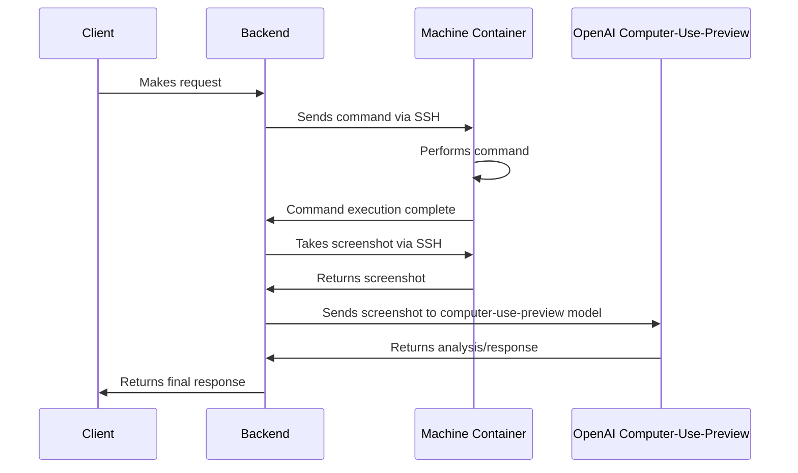

# Skycua

Skycua is a computer user agent project that can be used in local system using docker.

## System Components

### Demo

https://user-images.githubusercontent.com/ratnadeep007/skycua/assets/demo.mp4?raw=true

### Architecture



### 1. Frontend Application (skycua-fe)

A modern web application built with React, TypeScript, and Vite that provides a beautiful and intuitive interface for controlling and monitoring the user agent.

#### Frontend Features
- 🚀 Built with Vite for lightning-fast development
- 💎 Modern UI components using shadcn/ui and Radix UI primitives
- 🎨 Fully customizable design system with Tailwind CSS
- 📱 Responsive and mobile-friendly interface
- 🔒 Type-safe development with TypeScript
- 🔄 Real-time capabilities with Socket.IO
- 📊 Data visualization with Recharts
- 🎯 Form handling with React Hook Form and Zod validation
- 🌓 Dark mode support
- 🔍 Command palette (cmdk) for quick navigation
- 📅 Advanced date handling capabilities

#### Frontend Project Structure
```
skycua-fe/
├── src/              # Source code
├── public/           # Static assets
├── .github/          # GitHub Actions workflows
├── components.json   # shadcn/ui components config
├── nginx.conf        # Nginx configuration for Docker
├── vite.config.ts    # Vite configuration
└── tailwind.config.ts # Tailwind CSS configuration
```

#### Frontend Technology Stack
- Framework: React 18
- Build Tool: Vite
- Language: TypeScript
- UI Components: shadcn/ui + Radix UI
- Styling: Tailwind CSS
- Real-time Communication: Socket.IO
- Routing: React Router DOM
- VNC Client: React VNC
- Date Handling: date-fns

### 2. Backend Service (skycua-be)

A Python-based backend service that provides automated desktop interaction and control through SSH.

#### Backend Features
- 🖥️ Remote Desktop Control: Automated control of desktop environments via SSH
- 🖱️ Mouse Control: Click, drag, move, and scroll operations
- ⌨️ Keyboard Control: Type text and send keystrokes
- 📸 Screenshot Capability: Take screenshots of the remote desktop
- 🔒 Secure: SSH-based communication
- 🐳 Docker Support: Containerized deployment ready

#### Backend Project Structure
```
skycua-be/
├── server/
│   ├── core_lib/         # Core functionality
│   ├── handlers/         # Request handlers
│   └── main.py          # Application entry point
├── scripts/             # Utility scripts
├── tests/              # Test suite
└── docker/             # Docker configuration
```

#### Backend Dependencies
- FastAPI - Web framework
- Paramiko - SSH client
- OpenAI - AI integration
- Socket.IO - Real-time communication

### 3. Virtual Machine Environment

A containerized Ubuntu Desktop environment that serves as the execution environment for the user agent.

#### VM Features
- Full Ubuntu Desktop environment
- Web-based access through noVNC
- VNC client support
- Secure password protection
- Customizable resolution and display settings
- Shared directory support
- Resource management

## Getting Started

### Prerequisites
- Docker and Docker Compose
- Node.js (version specified in .nvmrc)
- npm or bun package manager
- Modern web browser

### Configuration

1. Set environment variables:
```env
OPENAI_API_KEY=your_openai_api_key
```

2. Start all services:
```bash
docker-compose up -d
```

### Access Methods

#### Web Interface
- Main Application: `http://localhost:9990`
- Direct noVNC Access: `http://localhost:6901`
  - Click "Connect"
  - Enter VNC password: `vncpassword`

### Service Ports
- Frontend UI: `9990`
- VNC: `5901`
- noVNC Web Access: `6901`
- SSH: `2222`
- Stream Server: `9998`
- Backend API: `8000`

## Development

### Frontend Development
```bash
cd skycua-fe
npm install
npm run dev
```

### Backend Development
```bash
cd skycua-be
python -m venv .venv
source .venv/bin/activate
pip install -e .
python -m server/main.py
```

### Contributing
1. Fork the repository
2. Create your feature branch (`git checkout -b feature/amazing-feature`)
3. Commit your changes (`git commit -m 'Add some amazing feature'`)
4. Push to the branch (`git push origin feature/amazing-feature`)
5. Open a Pull Request

## Deployment

The project includes GitHub Actions workflows for automated Docker image building and deployment. Images are published to GitHub Container Registry (ghcr.io) with multi-platform support:
- linux/amd64
- linux/arm64

Workflow triggers:
- Push to main and develop branches
- Pull requests to main branch
- Manual workflow dispatch
- Tag pushes (v*)

## Troubleshooting

### Common Issues
1. Container startup issues:
   - Check port availability
   - Verify system resources
   
2. Connection problems:
   - Allow initialization time
   - Check container logs: `docker-compose logs`
   
3. Performance issues:
   - Increase container resources
   - Adjust display settings
   - Allocate more system resources to Docker

## License

Skycua is open-source software licensed under the [MIT License](LICENSE). This means you can use, copy, modify, merge, publish, distribute, sublicense, and/or sell copies of the software, subject to the following conditions:

- Include the original copyright notice and license in any copy of the software/source
- The software comes with no warranty of any kind

See the [LICENSE](LICENSE) file for the full license text.


